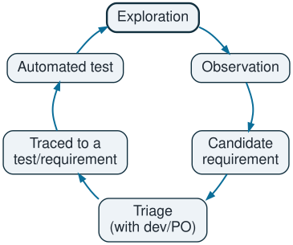
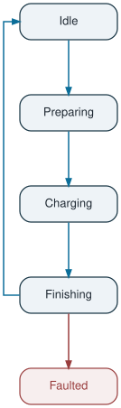
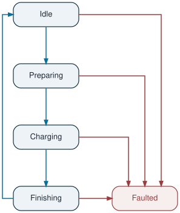

## Agenda

1. Building a test basis without formal requirements
2. Exercise 1 — Black-box test case design
3. Exercise 2 — Test case with AI assistance
4. Q&A


# Building a test basis without formal requirements {visibility="uncounted"}

## Sources and confidence

|Source                                     |Confidence                                             | Use                               |
|-------------------------------------------|-------------------------------------------------------|-----------------------------------|
|Standards                                  | High (interfaces, safety)                             | Invariants, external sequences    |
|Safety/physics invariants                  | High                                                  | "Never" rules                     |
|Developers                                 | Medium (intent, biased toward what they built)        | Rationale                         |
|Code                                       | High for does, zero for should                        | Model extraction, not an oracle   |
|Field logs, tickets                        | High relevance, medium correctness                    | Prioritization                    |
|Old docs, existing tests                   | Low                                                   | Leads only                        |
|Previous release                           | Consistency only                                      | Regression testing                |


## Behaviour: bug or intended


::: {.table-w .table-left style="--table-w: 70%" .small}

| Behaviour                                     | Conclusion                                         |
|:-                                             |                                                 :--|
|Violates a standard or safety requirement      | [BUG]{.badge .bug}                                         |
|Harmful for user or operator                   | [BUG]{.badge .bug}^[Even if intended. Escalate as a design issue.] |
|Contradicts developer intent                   | [BUG]{.badge .bug}                                                 |
|Intended and working                           | [INTENDED]{.badge .req}                                         |
|Nobody can decide                              | [PROVISIONAL]{.badge .prov}                  |
:::

<br/>

::: {.box .small .fragment .fade-in-then-semi-out}

**Decide, document, and compound**

Use Behaviour Decision Records to track decisions that compound into specifications.
Each BDR records:


::: {.column width="3%" .small}
:::

::: {.column width="27%" .small}

- ID
- Observed behavior
- FW version

:::

::: {.column width="6%"}
:::

::: {.column width="27%" .small}

- Decision
- Rationale
- Who decided

:::

::: {.column width="6%"}
:::

::: {.column width="27%" .small}

- Linked requirement/test IDs
- Sources consulted

:::

:::


## The workflow..

{.nostretch width="35%" fig-align="center"}

::: {.box .small .fragment .fade-in-then-semi-out}

**Possible health metrics:**

:::: {.columns .small}

::: {.column width="2%"}
:::

::: {.column width=auto}

- % of confirmed cells in the `state x event` matrix
- % of requirements still "observed", tracked per release
:::

::::

:::


## ..prevents freezing incorrect behaviour


::: {.box .smaller .fragment .semi-fade-out fragment-index=1}

**Two test classes:**

:::: {.columns}

::: {.column width="2%"}
:::

::: {.column width=auto}

- **Requirement tests**: based on confirmed behaviour (a failure triggers a bug)
- **Provisional tests**: based on observed behaviour (a failure triggers a review)

:::

::::

:::

<br/>

::: {.fragment .fade-in fragment-index=1}

|                                | Requirement test          | Provisional test                              |
|--------------------------------|---------------------------|-----------------------------------------------|
| Expected result from           | Baselined requirement     | Current observed behavior or best hypothesis  |
| Fail means                     | Bug                       | Behavior changed → triage (bug or decision)   |
| Pass means                     | Validation evidence       | Nothing changed                               |
| Counts for release sign-off    | Yes                       | No, reported separately**\***                 |
| Linked to                      | Requirement ID            | Open question ID + owner + deadline**\*\***   |
:::

::: aside
::: {.fragment .fade-in fragment-index=2}
**\*** Provisional tests still run, but they are not blocking.
:::
:::

::: aside
::: {.fragment .fade-in fragment-index=2}
**\*\*** Provisional tests **must expire**. If they sit unresolved for several releases, they silently become frozen incorrect behaviour.
:::
:::


# Exercise 1 {visibility="uncounted"}


## Interpretation of the state machine

:::: {.columns}

::: {.column width="50%"}

{.nostretch height="600" fig-align="center"}

:::

::: {.column width="50%"}

::: {.box .smaller .warn}
State Machine is ambiguous and partial (as per OCPP):

- Faulted should be reachable from all states.
- Missing states (Suspended, Unavailable, ...)

:::

:::
::::

## Interpretation of the state machine

:::: {.columns}

::: {.column width="50%" .dim}

{.nostretch height="600" fig-align="center"}

:::

::: {.column width="50%"}

{.nostretch height="600" fig-align="center"}

:::
::::


## Test cases {.smaller}


::: {.box .small .fragment .semi-fade-out fragment-index=1}

"Max limit allowed by the connector" is ambiguous: **[assumption]** the effective limit is the minimum of EVSE, EV, cable, ...

:::

::: {.fragment .fade-in fragment-index=1}

::: {.small}
**Preconditions:**

- Mocks / HIL setup to simulate an EV and a DC load
- Connector limit known (**[assumption]** $I_{max}$ = 200 A)
- The charger is in Idle
- No active faults
:::

<br/>

| ID    | Type              | Input                                                         | Expected result **\***                                                                                                                                                          |
|-|--|----|------|
| TC-01 | Nominal           | EV requests exactly $I_{max}$                                      | Idle→Preparing→Charging. Measured I = $I_{max}$ ± tolerance, with no overshoot beyond tolerance during ramp-up. Stable for N minutes, no fault. Meter values are consistent        |
| TC-02 | Boundary (above)  | EV requests $I_{max}$ + 1 A **\*\***  | Charger advertises EVSEMaxCurrent = $I_{max}$ and delivers ≤ $I_{max}$. The session is not rejected or faulted, just limited                                                           |
| TC-03 | Boundary (below)  | EV requests $I_{max}$ − 1 A                                        | Delivers the requested value exactly. This proves the limiting isn't over-aggressive or off-by-one                                                                              |
| TC-04 | Error             | While charging at $I_{max}$, inject a power module fault           | Transition to Faulted, current ramps to 0 A, contactors open within the specified time, session closed with the correct final meter value |


::: aside
**\*** every expected result needs a value, a tolerance, and a time limit
:::


::: aside
**\*\*** and a large value, e.g. $I_{max}$
:::

:::


## Exercise 1: Test Case TC-01

::: {.scrollable-content .smaller .box}

**Test Case ID:** TC-SM-IMAX-001 (TC-01)

**Title:** Start charging session with EV requesting exactly the connector maximum current

**Priority:** High

**Objective:** Verify that when the EV requests a current equal to $I_{max}$, the charger goes through Idle → Preparing → Charging, delivers $I_{max}$ within tolerance without overshoot, keeps it stable, and meters the energy correctly.

**Preconditions**

:::: {.columns}
::: {.column width="2%"}
:::
::: {.column width=auto .small}
- Firmware version recorded.
- The charger is powered on and in Idle state.
- The charger is connected to the CSMS simulator.
- An EV emulator is connected.
- A power analyzer is on the DC output.
- $I_{max}$ is configured, and its value is recorded from the charger configuration.
- No active faults are present.
:::
::::

**Test Data**

:::: {.columns}
::: {.column width="0%"}
:::
::: {.column width=auto}
| Parameter             | Value                     |
|-------------------|-----------------------------------|
| Output voltage        | 400 V DC                  |
| EV requested current  | $I_{max}$ = 400 A         |
| Hold time             | $T_{stable}$              |
:::
::::

**Test Steps and Expected Results**

| Step  | Action                                    | Expected Result|
|-|-----|------|
|1|EV emulator runs charge parameter discovery with EV max current = $I_{max}$|Charger advertises EVSE max current ≥ $I_{max}$ (checked in the protocol log).
|2|Let cable check and precharge complete|Both complete without error. No isolation fault.
|3|EV emulator requests target current = $I_{max}$| State Preparing → Charging.
|4|Observe the current ramp-up on the power analyzer| Current reaches $I_{max}$ ± $I_{tol}$ within $T_{ramp max}$. No sample exceeds $I_{max}$ + $I_{tol}$.
|5|Hold for $T_{stable}$|Current stays within $I_{max}$ ± $I_{tol}$. No fault, no derating event. Meter values are sent periodically.
|6|Compare Meter values energy with the power analyzer energy|Deviation within metering tolerance (TBD).
|7|EV emulator ends the session|Charging → Finishing. Current goes to 0 A. Contactors open. $V_{out}$ ≤ $V_{safe}$.
|8|Unplug the connector|Finishing → Idle. The meter is consistent with the measurement.

**Pass Criteria**

:::: {.columns .small}
::: {.column width="2%"}
:::
::: {.column width=auto}
- All expected results are met.
- The current never exceeds $I_{max}$ + $I_{tol}$ at any sample.
- Billed energy matches measured energy within tolerance.
- No transition to Faulted.
:::
::::

**Post-conditions**

:::: {.columns .small}
::: {.column width="2%"}
:::
::: {.column width=auto}
- The charger is in Idle and Available.
- The transaction is closed on the CSMS with correct energy.
:::
::::
:::


## Priorities and what's left out

::: {.box .smaller .fragment .semi-fade-out fragment-index=1}

**Priorities:**

:::: {.columns}

::: {.column width="2%"}
:::

::: {.column width=auto}
- Safety. Overcurrent leads to cable overheating. TC-02 and TC-04 cover this
- Availability. A customer shouldn't be stranded by a false fault at a legitimate limit. TC-01 and TC-02 cover this
- Billing. Meter consistency at high current. TC-01 and TC-04 cover this
:::
::::
Boundary value analysis gives $I_{max}$−1, $I_{max}$, and $I_{max}$+1. The large value test catches overflows and saturation bugs. Enforced by TC-03

:::

<br/>

::: {.box .small .fragment .fade-in-then-semi-out .fade-in fragment-index=1}
**Left out on purpose:**


::: {.table-w .table-left style="--table-w: 70%"}

| Rest | Reason |
|-|--|
| Thermal soak | Takes hours. Candidate for nightly runs |
| Real-vehicle tests | Belongs in a separate campain |
| Combined faults | Combinatorial explosion. Focus on single failures first. |
| HMI | Affects UX, less likely to have critical consequences |
:::

:::

# Exercise 2 {visibility="uncounted"}

## Working with AI

**AI prompt:**

```
You are a test engineer for DC fast chargers (EVSE)
The charger firmware has a session management state machine with states Idle → Preparing → Charging → Finishing → Faulted
Write a detailed test case to validate the correct sequence for interrupting a charging session started by the user, from the STOP command on the HMI up to reaching a safe state
Include test ID, objective, preconditions, test data, steps, and expected results
Reference relevant standards where applicable
```


## Raw AI draft


::: {.scrollable-content .smaller .box}

**Test Case ID:** TC-SM-STOP-001

**Title:** User-initiated charging session stop via HMI

**Priority:** High

**Objective:** Verify that when the user presses STOP on the HMI during an active charging session, the charger safely terminates energy transfer, transitions through the correct states, and reaches a safe state in compliance with IEC 61851-23 and OCPP 1.6.

**Preconditions**

:::: {.columns}

::: {.column width="2%"}
:::

::: {.column width=auto .small}
- The charger is powered on and in Idle state.
- The charger is connected to the CSMS via OCPP 1.6J and the connection is stable.
- A CCS2-compatible EV (or EV simulator) is connected.
- The user has been authorized via RFID and a charging session has been started.
- The charger is in Charging state and delivering power (e.g., 400 V, 100 A).
- No active faults are present.
:::

::::

**Test Data**

:::: {.columns}

::: {.column width="0%"}
:::

::: {.column width=auto}
| Parameter         | Value                             |
|-------------------|-----------------------------------|
| Connector type    | CCS2                              |
| Output voltage    | 400 V DC                          |
| Charging current  | 100 A                             |
| RFID tag          | Valid test tag (ID: 04A1B2C3D4)   |
| OCPP version      | 1.6J                              |
:::

::::

**Test Steps and Expected Results**

| Step  | Action                                    | Expected Result                                                                                                                               |
|-|--|-------|
| 1     | Verify the charger is in Charging state   | HMI displays charging screen with live power, energy and time. Session state = Charging.                                                      |
| 2     | Press the STOP button on the HMI          | HMI displays a "Stopping charging session…" message immediately.                                                                              |
| 3     | Observe state transition                  | Session state transitions from Charging to Finishing within 1 second.                                                                         |
| 4     | Observe power module behavior             | Charging current ramps down to 0 A within 2 seconds, as required by IEC 61851-23.                                                             |
| 5     | Observe EV communication                  | Charger sends a stop request to the EV via ISO 15118 / DIN 70121. The EV acknowledges.                                                        |
| 6     | Observe contactors                        | DC contactors open once current reaches 0 A.                                                                                                  |
| 7     | Observe output voltage                    | Output voltage drops below 60 V DC within 1 second, according to IEC 61851-23 clause 102.5.2.                                                 |
| 8     | Observe connector lock                    | Connector is unlocked, allowing the user to remove the cable.                                                                                 |
| 9     | Observe OCPP messages                     | Charger sends StopTransaction.req to the CSMS with reason = "Local" and the correct meterStop value. CSMS responds with StopTransaction.conf. |
| 10    | Observe HMI                               | HMI displays a session summary (energy delivered, duration, cost) and a "Please unplug your vehicle" message.                                 |
| 11    | User unplugs the cable                    | Session state transitions from Finishing to Idle. Charger sends StatusNotification.req with status = "Available".                             |

**Pass Criteria**

:::: {.columns .small}

::: {.column width="2%"}
:::

::: {.column width=auto}
- All expected results are met.
- The charger reaches a safe state with no residual voltage on the connector.
- No transition to Faulted state occurs.
- The system behaves gracefully and without errors throughout the sequence.
:::

::::

**Post-conditions**

:::: {.columns .small}

::: {.column width="2%"}
:::

::: {.column width=auto}
- The charger is in Idle state and ready for a new session.
- Transaction data is correctly stored and transmitted to the CSMS.
:::

::::

:::


## AI draft comments (1/2)

::: {.smaller .box .fragment .semi-fade-out fragment-index=1}
**Test Case ID:** TC-SM-STOP-001

**Title:** User-initiated charging session stop via HMI

**Priority:** High

**Objective:** Verify that when the user presses STOP on the HMI during an active charging session, the charger safely terminates energy transfer, transitions through the correct states, and reaches a safe state in compliance with IEC 61851-23 [\[AI-UNVERIFIED\]]{.bad} and OCPP 1.6 [\[ASSUMP\]]{.bad}
:::

<br/>

:::: {.columns}


::: {.column width="55%"}

::: {.smaller .box .fragment .fade-in-then-semi-out fragment-index=1}

:::: {.columns}

::: {.column width="0%"}
:::

::: {.column width=auto}

**Preconditions**

- The charger is powered on and in Idle state
- The charger is connected to the CSMS via OCPP 1.6J[\[ASSUMP\]]{.bad}
- A CCS2-compatible EV (or EV simulator) is connected
- The user has been authorized via RFID [\[ASSUMP\]]{.bad}
- The charger is \[..\] delivering power (e.g., 400 V, 100 A) [\[ASSUMP\]]{.bad}
- No active faults are present

:::

::::

:::

:::

::: {.column width="45%"}

::: {.small .box .fragment .fade-in-then-semi-out}

**Test Data**

| Parameter         | Value                             |
|-------------------|-----------------------------------|
| Connector type    | CCS2 [\[ASSUMP\]]{.bad}                              |
| Output voltage    | 400 V DC [\[ASSUMP\]]{.bad}                          |
| Charging current  | 100 A [\[ASSUMP\]]{.bad}                             |
| RFID tag          | Valid test tag (ID: 04A1B2C3D4) [\[ASSUMP\]]{.bad}   |
| OCPP version      | 1.6J [\[ASSUMP\]]{.bad}                              |

:::

:::

::::


## AI draft comments (2/2)

::: {.scrollable-content .small .box .fragment .semi-fade-out fragment-index=1}

**Test Steps and Expected Results**

| Step  | Action                                    | Expected Result                                                                                                                               |
|-|----|----------|
| 3     | Observe state transition                  | Session state transitions from Charging to Finishing within 1 second [\[ASSUMP\]]{.bad}                                                                         |
| 4     | Observe power module behavior [\[ask order confirmation\]]{.bad}             | Charging current ramps down to 0 A [\[< X A\]]{.bad} within 2 seconds [\[ASSUMP\]]{.bad}, as required by IEC 61851-23 [\[AI-UNVERIFIED\]]{.bad}                                                             |
| 5     | Observe EV communication [\[ask order confirmation\]]{.bad}                  | Charger sends a stop request to the EV via ISO 15118 / DIN 70121 [\[ASSUMP\]]{.bad}. The EV acknowledges [\[add observation point\]]{.bad}                                                        |
| 6     | Observe contactors [\[ask order confirmation\]]{.bad}                        | DC contactors open once current reaches 0 A                                                                                                  |

:::

<br/>

:::: {.columns}

::: {.column width="65%"}

::: {.smaller .box .fragment .fade-in-then-semi-out fragment-index=1}

**Pass Criteria**

- All expected results are met
- The charger reaches a safe state [\[ASSUMP\]]{.bad} with no residual voltage on the connector
- No transition to Faulted state occurs
- The system behaves gracefully [\[UNTESTABLE\]]{.bad} and without errors throughout the sequence

:::

:::

::: {.column width="35%"}

::: {.smaller .box .bad .fragment .fade-in-then-semi-out}

**Whole draft**

- No observation points (i.e., logs)
- Tests only the happy path

:::

:::

::::


## Edge cases and missing info

::: {.box .smaller .fragment .semi-fade-out fragment-index=1}

**Edge cases:**

- STOP during Preparing, CableCheck or PreCharge
- Double STOP
- EV ignores the stop request
- Simultaneous remote stop from the backend
- Backend offline (queue transaction, meter persisted)
- Power loss mid-sequence
- STOP by a non-authorized user

:::

<br/>

::: {.box .warn .smaller .fragment .fade-in-then-semi-out fragment-index=1}

**Vague or unverifiable in the scenario:**

- Define "safe state" measurably
- Determine expected sequence
- Determine end state (Finishing? Idle?)
- Define timing constraints

:::


## Pitfalls in using AI blindly


::: {.box .bad .smaller .fragment .semi-fade-out fragment-index=1}

**Pitfalls:**

- Assumptions -> becomes freezing
- Follows code -> adapts tests to existing code instead of challenging it
- Hallucinations -> specific thresholds, standard clauses and message names that look authoritative
- Confiramtion bias -> lowered reviewer's scrutiny
- Confidentiality -> firmware and logs should not go into non-approved tools

:::

<br/>

::: {.box .good .smaller .fragment .fade-in-then-semi-out fragment-index=1}

**Benefits:**

- Fast prototyping -> Get an initial, incomplete draft in seconds
- Reasoning -> Use AI as a brainstorming partner and coverage challenger ("what edge cases am I missing?")
- Boilerplate -> Use AI for boring, repeatable tasks and as a formatter
- Checks consistency -> Every AI-derived expected result stays tagged [AI-UNVERIFIED] until confirmed
- Repeatability -> Keep the prompts in the test repo, so the process is reproducible across releases
:::


# Thank you

# Q&A

#

# BDR: examples

## BDR-001 — Connector locked after EV-side disconnect

::: {.bdr}
**ID**
:   BDR-001

**Observed behavior**
:   Unplugging at the vehicle during `Charging` drives the session to `Faulted`.
    The connector stays locked and the station needs a technician reset;
    `StopTransaction` is sent with `reason = Other`.

**FW version**
:   4.8.2 — reproduced on 4.7.0 and 4.8.0

**Sources consulted**
:   IEC 61851-1, CP state B -> A · OCPP 1.6J `StopTransaction.reason` enum ·
    developer interview 2026-09-14 · field logs, 11 occurrences across 3 sites

**Decision**
:   [BUG]{.badge .bug} — defect raised, fix targeted for 4.9.0

**Rationale**
:   A customer-initiated disconnect is a normal end of session, not a fault.
    Locking the cable takes the charge point out of service, so this clears the
    top rung of the ladder on two counts. The developer confirmed the `Faulted`
    branch was written for CP loss *without* a preceding stop request.

**Who decided**
:   Test lead + SW owner (session mgmt); safety officer consulted, 2026-09-15

**Linked IDs**
:   `REQ-SM-014` (new) · `TC-SM-201/202/203` · defect `EVSE-4471`
:::

::: {.notes}
This is the easy case: a standard and a developer both say the behavior is
wrong, so the ladder resolves on the first rung. Worth noting that the field
logs came first and the standard second — the logs told us where to look.
:::

## BDR-002 — Charging continues while the backend is unreachable

::: {.bdr}
**ID**
:   BDR-002

**Observed behavior**
:   Loss of the OCPP connection during `Charging` does not end the session.
    Meter values are queued locally and replayed on reconnect; the HMI shows
    only an offline icon.

**FW version**
:   4.8.2

**Sources consulted**
:   OCPP 1.6J offline-transaction behavior · SW owner interview 2026-09-16 ·
    CPO operations feedback `OPS-882` · commit message of the original change

**Decision**
:   [INTENDED]{.badge .req} — undocumented, promoted to a requirement

**Rationale**
:   Ending the session would strand a paying customer over a fault that is not
    theirs, and the queue-and-replay is deliberate, not accidental. The behavior
    was never wrong, only unwritten — so the fix is documentation, not code.
    Promoted with its limits made explicit rather than left implicit.

**Who decided**
:   Test lead + SW owner + product owner, 2026-09-16

**Linked IDs**
:   `REQ-SM-031` (new, from this record) · `TC-SM-310/311` ·
    `TC-SM-312` (queue overflow)
:::

::: {.notes}
The interesting half is what "promoted" means: REQ-SM-031 pins the queue depth
and the replay-on-reconnect rule, so the next tester does not have to rediscover
that 2000 is the limit. This is the mechanism that grows the test basis release
by release.
:::

## BDR-003 — Silent derate on power module error

::: {.bdr}
**ID**
:   BDR-003

**Observed behavior**
:   A single power module fault during `Charging` does not end the session: the
    charger derates to the healthy modules and continues at reduced current.
    The HMI shows nothing; the customer sees only a slower charge.

**FW version**
:   4.9.0-rc1

**Sources consulted**
:   Developer interview 2026-09-17 — derate deliberate, HMI behavior
    "not specified" · no written spec found · HMI style guide silent on derate

**Decision**
:   [PROVISIONAL]{.badge .prov} — accepted for 4.9.0, expires 2026-12-01

**Rationale**
:   Derating beats aborting, and that half is intended. Whether the customer
    must be *told* is a product decision nobody in the room could make, so it is
    recorded as an open question instead of being frozen by silence. The test
    pins the behavior against drift but is tagged `provisional`: it is evidence
    of what the firmware does, not yet agreement that it is right.

**Who decided**
:   Test lead; escalated to product owner — open at time of writing

**Linked IDs**
:   `REQ-SM-047` (provisional) · `TC-SM-420`, tagged `provisional` ·
    open question `Q-SM-009`
:::

::: {.notes}
This is the answer to "how do you avoid freezing the wrong behavior". Two
devices do the work: the expiry date, which forces the question back onto
someone's desk, and the provisional tag, which stops a green test being read as
an approved requirement.
:::

<!-- ============================================================
     REFERENCE APPENDIX — delete everything below before presenting.
     These slides are marked visibility="uncounted" so they do not
     inflate the slide numbers on the real deck.
     ============================================================ -->


# Exercise 1: test cases

## Exercise 1: Test Case TC-01

::: {.scrollable-content .smaller .box}

**Test Case ID:** TC-SM-IMAX-001 (TC-01)

**Title:** Start charging session with EV requesting exactly the connector maximum current

**Priority:** High

**Objective:** Verify that when the EV requests a current equal to $I_{max}$, the charger goes through Idle → Preparing → Charging, delivers $I_{max}$ within tolerance without overshoot, keeps it stable, and meters the energy correctly.

**Preconditions**

:::: {.columns}
::: {.column width="2%"}
:::
::: {.column width=auto .small}
- Firmware version recorded.
- The charger is powered on and in Idle state.
- The charger is connected to the CSMS simulator.
- An EV emulator is connected.
- A power analyzer is on the DC output.
- $I_{max}$ is configured, and its value is recorded from the charger configuration.
- No active faults are present.
:::
::::

**Test Data**

:::: {.columns}
::: {.column width="0%"}
:::
::: {.column width=auto}
| Parameter             | Value                     |
|-------------------|-----------------------------------|
| Output voltage        | 400 V DC                  |
| EV requested current  | $I_{max}$ = 400 A         |
| Hold time             | $T_{stable}$              |
:::
::::

**Test Steps and Expected Results**

| Step  | Action                                    | Expected Result|
|-|-----|------|
|1|EV emulator runs charge parameter discovery with EV max current = $I_{max}$|Charger advertises EVSE max current ≥ $I_{max}$ (checked in the protocol log).
|2|Let cable check and precharge complete|Both complete without error. No isolation fault.
|3|EV emulator requests target current = $I_{max}$| State Preparing → Charging.
|4|Observe the current ramp-up on the power analyzer| Current reaches $I_{max}$ ± $I_{tol}$ within $T_{ramp max}$. No sample exceeds $I_{max}$ + $I_{tol}$.
|5|Hold for $T_{stable}$|Current stays within $I_{max}$ ± $I_{tol}$. No fault, no derating event. Meter values are sent periodically.
|6|Compare Meter values energy with the power analyzer energy|Deviation within metering tolerance (TBD).
|7|EV emulator ends the session|Charging → Finishing. Current goes to 0 A. Contactors open. $V_{out}$ ≤ $V_{safe}$.
|8|Unplug the connector|Finishing → Idle. The meter is consistent with the measurement.

**Pass Criteria**

:::: {.columns .small}
::: {.column width="2%"}
:::
::: {.column width=auto}
- All expected results are met.
- The current never exceeds $I_{max}$ + $I_{tol}$ at any sample.
- Billed energy matches measured energy within tolerance.
- No transition to Faulted.
:::
::::

**Post-conditions**

:::: {.columns .small}
::: {.column width="2%"}
:::
::: {.column width=auto}
- The charger is in Idle and Available.
- The transaction is closed on the CSMS with correct energy.
:::
::::
:::


## Exercise 1: Test Case TC-02

::: {.scrollable-content .smaller .box}

**Test Case ID**: TC-SM-IMAX-002 (TC-02)

**Title**: EV requests current above the connector maximum

**Priority**: High

**Objective**: Verify that when the EV requests a current above I_{max}, the charger limits the delivered current to I_{max} without rejecting or faulting the session, and handles extreme request values without overflow.

**Preconditions**

Same as TC-SM-IMAX-001.

**Test Data**

[the test is run once per requested value]

:::: {.columns}
::: {.column width="0%"}
:::
::: {.column width=auto}
| Parameter             | Value                     |
|-------------------|-----------------------------------|
| Connector type        | CCS2                      |
| EV requested current        | Run A: $I_{max}$ + 1 A · Run B: 2 × $I_{max}$ · Run C: maximum value the protocol allows                  |
| Hold time             | $T_{stable}$              |
:::
::::

**Test Steps and Expected Results**

| Step  | Action                                                    | Expected Result|
|-|--|----|
| 1     | EV emulator runs charge parameter discovery               | Charger advertises EVSE max current = $I_{max}$.                                                              |
| 2     | EV emulator requests the value for this run               | Session is not rejected. Preparing → Charging.                                                                |
| 3     | Observe the ramp-up                                       | No sample exceeds $I_{max}$ + $I_{tol}$.                                                                      |
| 4     | Hold for $T_{stable}$                                     | Current stays within $I_{max}$ ± $I_{tol}$. No Faulted state.                                                 |
| 5     | Run C only: check the logs and the charger's reaction     | No overflow or wrap-around (current does not jump to a low or negative value). No process crash or restart.   |
| 6     | End the session and unplug                                | Normal Finishing → Idle. StopTransaction is correct.                                                          |

**Pass Criteria**

:::: {.columns .small}
::: {.column width="2%"}
:::
::: {.column width=auto}
- The current is limited to $I_{max}$ + $I_{tol}$ in all three runs.
- The session continues. It is neither rejected nor faulted.
- The extreme value (Run C) is handled safely.
:::
::::

**Post-conditions**

:::: {.columns .small}
::: {.column width="2%"}
:::
::: {.column width=auto}
- The charger is in Idle and Available.
:::
::::

:::


## Exercise 1: Test Case TC-03

::: {.scrollable-content .smaller .box}

**Test Case ID:** TC-SM-IMAX-003 (TC-03)

**Title:** EV requests current just below the connector maximum

**Priority:** Medium

**Objective:** Verify that a request just below I_{max} is delivered exactly as requested. This rules out off-by-one errors and overly aggressive limits.

**Preconditions**

Same as TC-SM-IMAX-001.

**Test Data**

:::: {.columns}
::: {.column width="0%"}
:::
::: {.column width=auto}
| Parameter             | Value                     |
|-------------------|-----------------------------------|
| Output voltage        | 400 V DC                  |
| EV requested current  | $I_{max}$ - 1 A = 199 A         |
| Hold time             | $T_{stable}$              |
:::
::::

**Test Steps and Expected Results**

:::: {.columns}
::: {.column width="0%"}
:::
::: {.column width=auto}
| Step  | Action                                    | Expected Result|
|-|-----|------|
|1|EV emulator requests I_{max} − 1 A|Preparing → Charging.|
|2|Hold for T_{stable}|Delivered current = requested value ± I_{tol}. It is not limited lower.|
|3|End the session and unplug|Normal Finishing → Idle.|
:::
::::

**Pass Criteria**

:::: {.columns .small}
::: {.column width="2%"}
:::
::: {.column width=auto}
- The delivered current matches the request within tolerance for the whole T_{stable} period.
:::
::::

**Post-conditions**

:::: {.columns .small}
::: {.column width="2%"}
:::
::: {.column width=auto}
The charger is in Idle and Available.
:::
::::

:::


## Exercise 1: Test Case TC-04

::: {.scrollable-content .smaller .box}
**Test Case ID:** TC-SM-IMAX-004 (TC-04)

**Title:** Power module fault while charging at the connector maximum current

**Priority:** High

**Objective:** Verify that a power module fault while charging at $I_{max}$ brings the charger to Faulted and a safe state within the time limits, closes the session with correct metering, and blocks new sessions until the fault is cleared.

**Preconditions**

:::: {.columns}
::: {.column width="2%"}
:::
::: {.column width=auto .small}
- Same as TC-SM-IMAX-001.
- A fault injection mechanism is available: either a software hook or a hardware fault on the power module.
:::
::::

**Test Data**

:::: {.columns}
::: {.column width="0%"}
:::
::: {.column width=auto}
| Parameter             | Value                     |
|-------------------|-----------------------------------|
| Output voltage        | 400 V DC                  |
| EV requested current  | $I_{max}$ = 400 A         |
| Hold time             | $T_{stable}$              |
| Injected fault        | Power module error        |
:::
::::

**Test Steps and Expected Results**

|Step|Action|Expected Result|
|-|------|--------------|
|1|Run TC-SM-IMAX-001 steps 1–5|Charging at $I_{max}$, stable.|
|2|Inject the power module fault and record the time t0|State Charging → Faulted.|
|3|Measure the current|Current reaches 0 A within $T_{shutdown max}$ from t0.|
|4|Observe the contactors and the output voltage|Contactors open. $V_{out}$ ≤ $V_{safe}$ within the specified time (TBD).|
|5|Observe the OCPP messages|StatusNotification = Faulted with errorCode and vendorErrorCode. StopTransaction.req with a meterStop matching the measurement.|
|6|Observe the HMI|An error / out-of-service message is displayed.|
|7|Try to start a new session|Authorization or start is refused while the fault is active.|
|8|Clear the fault|Faulted → Idle (or reset required, per OQ-05). StatusNotification = Available.|

**Pass Criteria**

:::: {.columns .small}
::: {.column width="2%"}
:::
::: {.column width=auto}
- The safe state is reached within the time limits.
- The final billed energy equals the measured energy up to t0.
- No new session is possible while the fault is active.
:::
::::

**Post-conditions**

:::: {.columns .small}
::: {.column width="2%"}
:::
::: {.column width=auto}
- The fault is cleared and the charger is in Idle and Available.
:::
::::

:::
